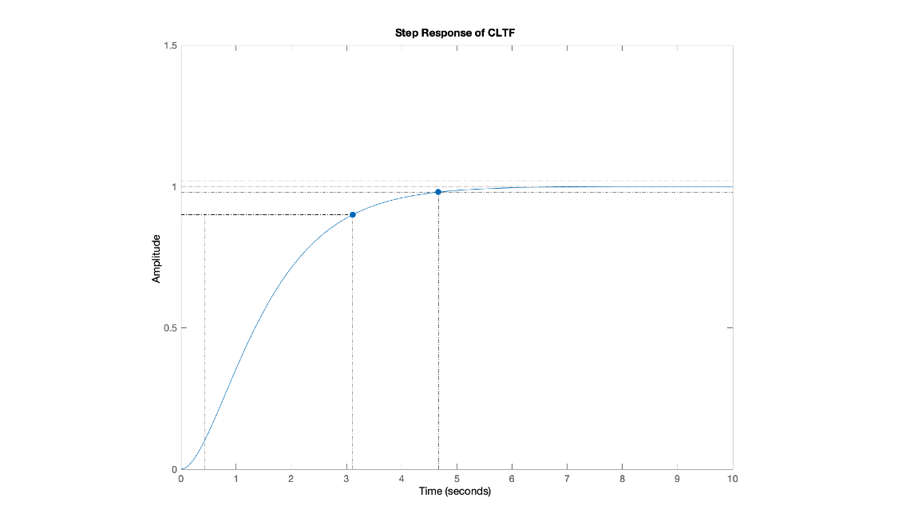

# **Examining Adaptive Cruise Control Strategies**

**By James O&#39;Connor**

**Vehicle Dynamics**

Institute of Technology, Sligo

## 1. Introduction

The goal of this report is to design an ACC controller for use on an Irish motorway. The ACC should be able to respond to a stalled vehicle that it encounters such may be the case if there was roadworks, slowdowns or a car crash on the motorway. The commercially available vehicle used as an example vehicle in the analysis was an Audi A3.

The report begins by outlining a simple proportional control with lead compensation for the speed control element of the ACC system. The report will then examine the vehicle following element of the ACC system examining two strategies, constant spacing an constant time gap. The report will conclude with the analysis of a transitional controller used to manage the change between the two modes of ACC.

## 2. Upper level Controllers

In an adaptive cruise control system, three potential modes of operation are:

1. Speed control, where there is nothing in from of the vehicle
2. Vehicle following mode, when it has locked onto a vehicle in front moving at a different speed to it
3. Transitional mode, the mode that manages the switch between the two

The output of all of these is the desired acceleration which is fed to the lower controller. This section will look at the above three modes in detail.

### 2.1 Speed Control (Cruise Control)

As the brief states to use a first order system and as we are only concerned with a single input, the desired longitudinal velocity and a single output, the actual longitudinal velocity, we can use a first order system response to a step input.

Our input to this system is , the desired longitudinal acceleration and our output is , our actual longitudinal acceleration. To change our velocity i.e. move from to , we have to increase or decrease our acceleration. When we are at a steady state, our acceleration is zero, therefore the acceleration of the vehicle is our tracking error, which we are trying to minimise.

The upper level controller is allowing for the time lag for the lower controller to reach steady state, i.e. is equal to zero. To model this time lag of the vehicles actual acceleration to our desired vehicle acceleration, we use the following equation:

Using the final value theorem, as approaches infinity, approaches zero, which would mean our destination acceleration is equal to our actual acceleration.

We now have to select the time constant, . This value represents the time constant for which the dynamics of the system are significant (University of Michigan, 2020). In our case, we want to select a time value for that allows us to reach 63.2% of our desired output. A value of 0.4 was chosen in the design of this system as a realistic time lag of the lower level controller.

The output from our plant is the actual velocity of the vehicle. The input to our plant is the desired acceleration, therefore our Laplace transfer function, output over input is which is the integral of equation (1) divided by equation (1). Coupling this with our Laplace Transform of the step input, yields the following equation for our plant:

Adding in our value for our time constant, we get the following transfer function for our plant:

A simple proportional controller can be used to add a layer of control to the error signal. Examining the root locus plot of the open loop transfer function, we get the following:

Using a gain of 0.625 is the highest we can use without introducing a certain level of overshoot into our system. After that our system becomes underdamped as we increase the gain. As we do not want the car to unintentionally overshoot a speed limit, the value of 0.625 was selected for the gain to avoid this overshoot. Multiplying this by our transfer function gives us our closed loop transfer function as follows:

The system takes approximately 3 seconds to reach its 90% value and over 4.5 seconds settling time. This is as good as we can do at = 0.4 and a critically damped system. We can use a lead compensator to improve the performance of the system. This allows us to add poles to the system to improve the response. The zeros and poles for the lead compensator were placed at -2 and -8 respectively.

Using lead compensation, time taken to reach its 90% value has been reduced by 33% (or 1 second) and settling time also reduced by 33% (or 1 second) with the gain set to 4.5 as per the root locus plot. Our final closed loop transfer function with lead compensation is:

We could increase the gain further to allow for an even faster response with up to 2% overshoot. However, under normal road conditions the jerk of vehicle i.e. the rate of change of acceleration and deceleration with respect to the safety and comfort of the passenger also needs to be considered. This controller should provide an efficient response to change in speed without exceeding the acceleration limitations to ensure safety and comfort of the passengers.

### 2.2 Vehicle Following

To design an adequate and road-worthy vehicle following strategy for our ACC controller, we need to ensure two control criteria are satisfied:

1. Individual vehicle stability – spacing error between the host and preceding vehicle tends to zero.
2. String stability – In the case where all vehicles were autonomous and using the same controller, we need to be cognizant of a bullwhip amplification problem, or the avoidance thereof. If they were all using the same system, new need to ensure that there is no propagation of spacing errors as we move backwards in vehicles. Also the sign of the error (positive or negative) must always match the preceding error signal.

Two potential spacing strategies that can be used for vehicle following are:

1. Constant spacing strategy
2. Constant time gap strategy

#### 2.2.1 Constant Spacing Strategy

This strategy does not fulfil our string stability control criteria, therefore the constant spacing strategy should not be used in this instance.

#### 2.2.2 Constant Time Gap (CTG) Strategy

##### 2.2.2.1 Selecting parameters

We can model the transfer function using the transfer function for the string stability of the CTG strategy, as per below:

In order for us to use the above equation, we need to select values for and . is the time gap between vehicles. For we know that it needs to be at least twice the value of (time response of engine dynamics) to ensure stability. Therefore h was set to 1, which is 2.5 times our value of from above (0.4), which also simplifies our calculations.

Now that we have satisfied the above constraint, we know we can find a value for that will ensure the magnitude of our response will always be less than or equal to 1, and string stability is maintained. To find a suitable range, multiple experiments were undertaken to find the correct value for .

From this graph, a value of approximately 0.4 for gave the best time response. Using and yields the following transfer function:

For this control system to be stable, two conditions must be met. The dominant poles of this system should not be a complex conjugate pair, and there should not be any zeros completely to the right of the poles of the system. To make sure these conditions are met, a pole-zero map plot was used.

From this graphing we can determine that the dominant pole is a real number with no conjugate part, and the zeros are all to the left of the rightmost pole, ensuring stability of the system.

Finally, to prove string stability, that the magnitude of our system will remain stable across a bandwidth of frequencies, a bode plot of our CTG transfer function was used to model the magnitude response at different frequencies.

From this we can confirm that at lower frequencies (up to approximately 1 rad/s) our system remains at 0 magnitude and tapers off at higher frequencies. This conforms to the desired behaviour of this type of system as we want large responses at low frequencies i.e. change in distances between vehicles and little response at high frequencies such as those caused by sensor noise.

### 2.3 Transitional Trajectory

A transitional controller is used to facilitate the switch between modes of cruise control such as speed control and vehicle control explored so far.

#### 2.3.1. Why we need A Transitional Controller

To demonstrate the need for a transitional controller, consider a scenario where a car is travelling at the speed limit of an Irish motorway, 33.33m/s, that encounters a road traffic accident during wet road conditions. The recommended stopping distance for a car travelling at this speed under these road conditions is 145 metres (Aviva, 2020). Therefore once the car reaches this distance it should start to decelerate in order to safely and comfortable come to a stop. To work out the desired acceleration at 145 metres, the following equation is used:

Using the same parameters we defined for designing our vehicle following controller ( , our equation for desired acceleration becomes:

The value is our relative velocity, or the velocity of the preceding vehicle relative to the host vehicle. If the preceding vehicle has stalled, and we are travelling at 33.33m/s then this value is -33.33m/s, making our equation:

The value is our initial spacing error and is calculated using the equation:

where is the distance between the front of the two vehicles, L is the length of the preceding vehicle and is the speed of the host vehicle. Setting L to be the safe stopping length under wet road conditions (145m) and the length of the Audi A3 vehicle at 4.45 (AutomobileDimension, 2020) our initial spacing error becomes:

Adding this to our equation (10) for desired acceleration, yields the following:

Under these road conditions, we should start to decelerate at 145 metres if we are to come to a comfortable stop before reaching the stalled vehicle. However, our CTG control law tells us to accelerate, hence why it cannot be used directly to follow a newly encountered vehicle. A transitional trajectory is required here.

#### 2.3.2. Operation of a Transitional Controller

diagrams are used in the design of a transitional controller. The R – R dot diagram conveys the relationship between the distance or range between vehicles and the relative velocity of the vehicles over time. The transitional controller can decide whether to use speed control, spacing control or to brake has hard as possible to avoid crashing.

Take an example of a car travelling on a road using speed control that encounters a preceding vehicle up ahead. If the host vehicle is travelling at a faster velocity than the preceding vehicle which would be the case with a stalled vehicle, there is a point at which the host vehicle, travelling at constant velocity, needs to start decelerating in order to maintain a desired distance or range. This point, called R plotted against the velocity maps the switching line. This switching line is depicted linearly on the diagram as follows:

where is the current range between preceding and host vehicle, is the desired range, is the slope and is the rate of change of the range.

However, to decelerate linearly would not be comfortable for the passenger, as constant deceleration is a parabolic function, therefore we use a parabolic function to map this deceleration. This function aims to cross the R axis at , the point where the switching line crosses the R axis, which is our desired range. Our equation for this parabolic function is as follows:

where D is the deceleration value for the vehicle. In the next two sections, the parabolic function and switching line for a car on a motorway under wet road conditions are created.

#### 2.3.3. equation for parabola when constant deceleration -3.5m/s required

Taking ourexample from 2.3.1 above, we know that our value is 145m, which is a safe range between vehicles under these conditions, and our value is 33.33m/s, which makes our parabolic deceleration:

At a deceleration of 3.5m/s^2:

#### 2.3.4. Switching Line for an Irish Motorway During Wet Road Conditions

Continuing our example from 2.3.3 above, and using the R value calculated, we can calculate the slope of the switching line:

becomes:

making equal to -4.76. The equation for our switching line becomes:

## 3. Results and Conclusions

In the design of this ACC system, a number of results have been achieved; A control strategy for stable speed control was created, an optimal constant time gap strategy was designed for vehicle following and a switching line equation and transitional trajectory equation was derived. However, there is much more work can be done with the outcomes achieved in this report. The calculations in this report are for an Irish motorway under wet conditions. This heavily affects our desired range between preceding and host vehicles which changes the behaviour of out transitional controller. In reality, the desired range will vary based on road conditions and relative speed of other vehicles, which is one area for expansion and simulation.

The diagram indicates that the deceleration was adequate to reach the desired final range at zero velocity. However, these calculations are based on the assumption that the parabolic curve crosses the R axis exactly at the final range. In reality, this final range usually will not be reached exactly within the ranges of deceleration, and additional acceleration may be needed to reach the final R range.

Thirdly, the constant spacing strategy was not explored in this report based on the assumption that the vehicles using the ACC system are autonomous i.e. they are not connected to each other or the surrounding infrastructure. In the future however, V2X communication and platooning of vehicles may be possible and this control law could be explored more for vehicle following mode.

## 4. Bibliography

AutomobileDimension, 2020. _https://www.automobiledimension.com/audi-car-dimensions.html._ [Online]
 Available at: automobiledimension
 [Accessed 28 12 2020].

Aviva, 2020. _Time And Space._ [Online]
 Available at: https://www.aviva.ie/insurance/car-insurance/time-and-space/#:~:text=Remember%2C%20speed%20limits%20are%20a,and%20not%20a%20target%20speed.&amp;text=The%20maximum%20speed%20limit%20on,road%2C%20it%20is%20145%20metres.
 [Accessed 28 Dec 2020].

University of Michigan, 2020. _System Analysis._ [Online]
 Available at: https://ctms.engin.umich.edu/CTMS/index.php?example=Introduction&amp;section=SystemAnalysis
 [Accessed 28 Dec 2020].
